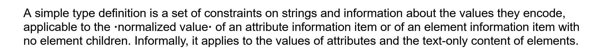

# Contents

This directory holds a tool for producing **MS Word** versions of some important
specifications, like Internet RFCs or W3C Recommendations.

## Motivation

The main motivation behind this tool is to have the ability to reformat the
text, in terms of font, font size, colors, and style in general, to suit the
reader's preferences. 

For example, Internet **RFC**s on the IETF's web site, such
as [RFC 3986](https://datatracker.ietf.org/doc/html/rfc3986), come with
pre-formatted paragraphs, with line breaks that hard-code a certain maximum
line width in characters. But one reader might prefer a smaller font and
smaller margins, hence bigger lines (more characters per line), more text per
page, and less pages overall; a different reader might be more confortable with
a bigger font, and smaller lines, even it means more pages.

**W3C Recommendations** are complex documents, often using cross-references and
hyperlinks to help navigate that complexity, but the formatting choices are not
to everyone's liking. References to a defined terms, for example, are
hyperlinks pointing to the term's definition, highlighted by enclosing them in
a pair of _middle dots_, an unusual character that reminds us of Word's
representation of a blank space, and also creates confusion with the sentence's
normal puctuation:



In this example from the XML Schema specification, the words "normalized value"
are enclosed in middle dots, indicating a link to their definition. Other means
could be used to highlight this link, such as displaying it in a different
background color, but the W3C website doesn't give you that possibility.

MS Word with its styles is a familiar tool that makes it easy to reformat text
to suit your reading preferences.

Converting all specification documents to MS Word provides another benefit: by
putting different texts in a single common format, it allows us to compare
their sizes (in number of pages) and lets us get a sense of how big a text is,
compared to some other texts that we've read recently.

## Implementation

Technically, the tools are python scripts that read html or xml documents, from
file or from an URL, and convert them to Microsoft's .docx format (otherwise
known as OOXML ??? FIXME) using the python-docx module.

## W3C Documents

We are interested in the following documents

* XML Schema Part 0: Primer
* XML Schema Part 1: Structures
* XML Schema Part 2: Datatypes

## Implementation Details

The `w3c.py` script parses the XML versions of W3C documents and produces a
.docx document. Suppose you downloaded the XML Schema Primer to a file called
`primer.xml`, you could convert it to MS Word with the following command: 

```console
py w3c.py primer.xml

```
This will produce a `primer.docx` file in the same directory. 

### specref

The `<specref>` element is used in W3C documents to link to a location inside
the same document. Target locations are elements (such as `<div>`, `<p>`, or
others), with an `id` attribute identifying the target. The `ref` attribute on
a `<specref>` is used to match against the target's `id`.

# With target title

In some cases, the target is a section title, with a child `<head>`
element. The text inside `<head>` has two uses, it is both:
* the actual title text, in this section
* the link text in the references

Target elements in this category include `<div>` (`<div1>`, `<div2>`, etc.),
`<schemaComp`>, `<constraintnote>`, ...

# With no target title

In other cases, there is no `<head>` element associated to the target, and no
easy way to determine a link text. Target elements in this category include
`<p>` and `<note>`.

For example, in the XML Schema
Primer 
[Appendix E.1 XML Schema Elements](https://www.w3.org/TR/2004/REC-xmlschema-0-20041028/primer.html#indexEl),
there is a list of XML Schema elements, with links to examples where they
appear in the text and in the normative recommendation document..

In the web version, the link to an example is the target paragraph's section
number (§2.7), but the XML version simply includes the `<specref ref="ref18"/>`
element, with no text. Currently we use the value of the `ref` attribute as the
link text.

In the target text, we find a paragraph with an `id` attribute:

```xml
<p id="ref18">There exists a third option for

```
